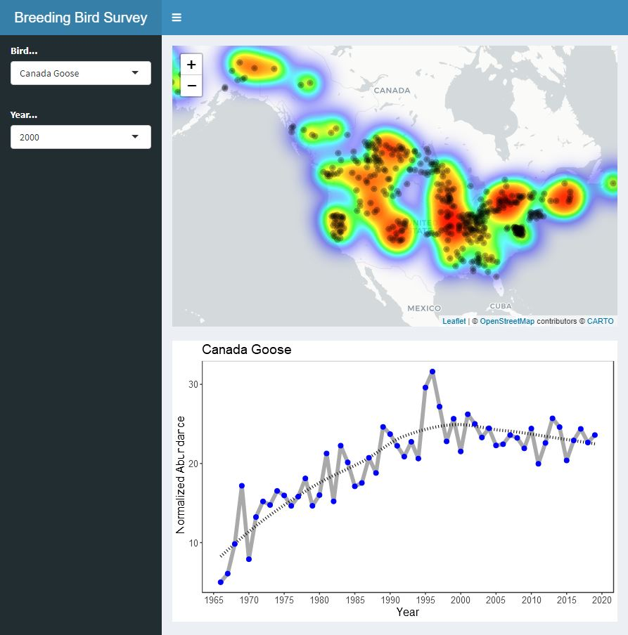

# Breeding Bird Survey App

This app is built to visualize the geographic distribution of bird populations in North America using data collected as part of the North American Breeding Bird Survey. This data set is curated by [USGS Patuxent Wildlife Research Center and the Canadian Wildlife Service](https://www.pwrc.usgs.gov/bbs/) and is composed of vehicle based bird surveys conducted along roadways across the United States and Canada since 1966.

The goal of this app is to provide a convient, dynamic application for visualizing the density and geographic distribution of individual bird species across North America. A working version of the app is hosted on Shiny Server [here](https://zpwistort.shinyapps.io/breeding-bird-survey-app/?_ga=2.27263292.1806404082.1620945288-531031520.1620783041).

